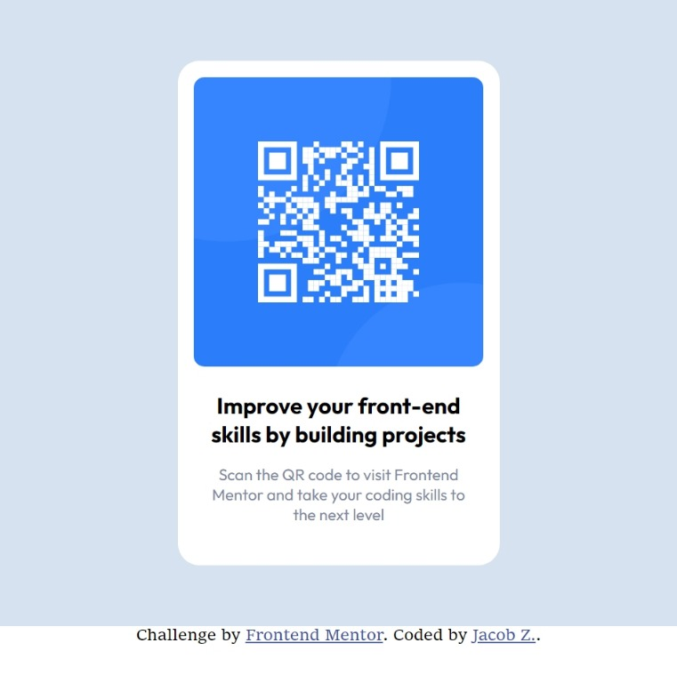

# Frontend Mentor - QR code component solution

This is a solution to the [QR code component challenge on Frontend Mentor](https://www.frontendmentor.io/challenges/qr-code-component-iux_sIO_H). Frontend Mentor challenges help you improve your coding skills by building realistic projects. 

## Table of contents

- [Overview](#overview)
  - [Screenshot](#screenshot)
  - [Links](#links)
- [My process](#my-process)
  - [Built with](#built-with)
  - [What I learned](#what-i-learned)
  - [Continued development](#continued-development)
- [Author](#author)
- [Acknowledgments](#acknowledgments)


## Overview

This is the First project from [FrontEndMentor](https://frontendmentor.io/) from their first learning path.

### Screenshot



### Links

- Solution URL: [Solution](https://github.com/Teezee86/FEMqr-code-challenge.git)
- Live Site URL: [Deployed Page](https://teezee86.github.io/FEMqr-code-challenge/)

## My process

### Built with

- Semantic HTML5 markup
- CSS custom properties
- Mobile-first workflow


### What I learned

When creating this project i was able to practice more with margins and padding. I was able to have both of them work togeher to keep the ratio and look of the page intact scaling across multiple width sizes. With this being a fixed care the only section that actually grows or shrinks is the background.

<h1>Some HTML code I'm proud of</h1>

I am trying to learn BEM for naming classes and i think Im kind of understanding the concept now.
This the img element I used with the class name :

```

```

### Continued development

Creating Semantic and accessible HTML and a solid understanding of BEM class naming.

CSS is something I also feel i could improve on, for example not repeating myself and the organization of my css.


## Author

- Website - [Jacob Z.--Currently no personal website but here is my git hub](https://github.com/Teezee86)
- Frontend Mentor - [@Teezee86](https://www.frontendmentor.io/profile/Teezee86)
- Twitter - [@yourusername](https://www.twitter.com/TeeZee86e)


## Acknowledgments

I'd like to give a shout out to [@grace-snow](https://www.frontendmentor.io/profile/grace-snow) for giving my first solution for this project a look over and giving some guiding tips to set my mark up and css in the right direction. (hopefully this solution shows progress.)
Also her pointing out the paddings and margins. Thanks for the constructive criticism.
